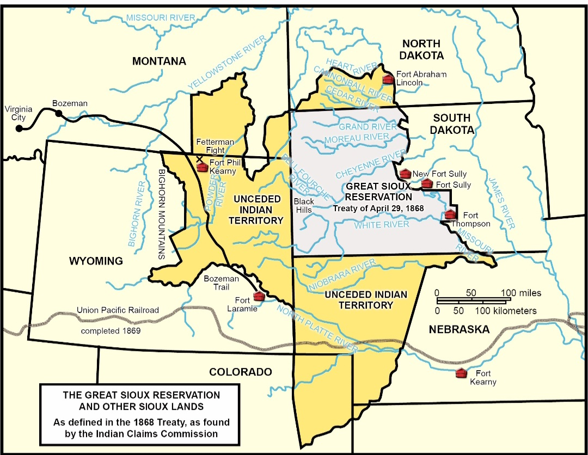
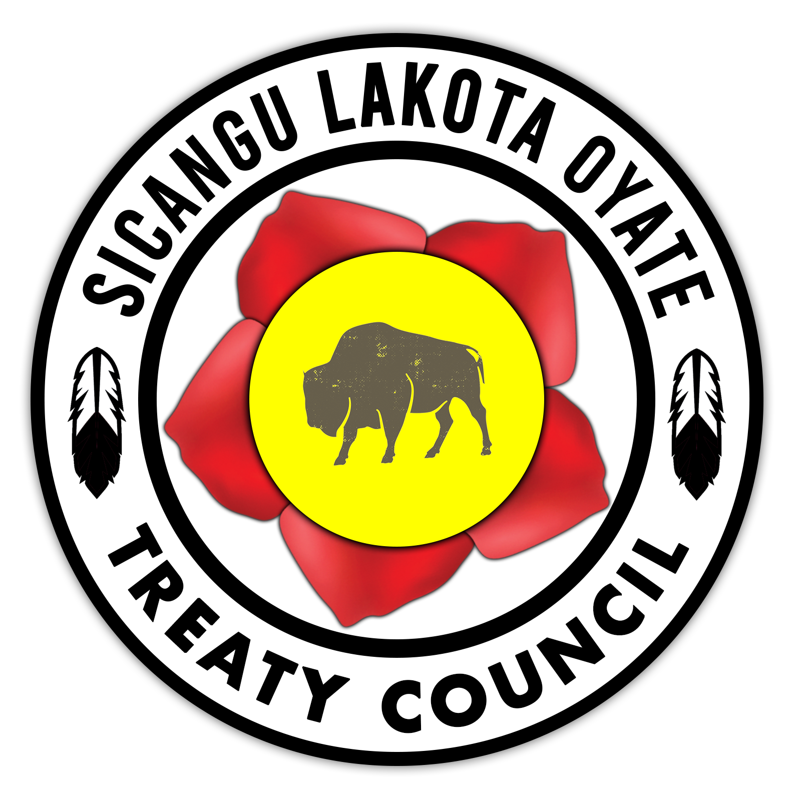

     <table>
        <td> 
            
        </td>
        <td>
            
        </td>
        <td>
            
        </td>
     </table>

# Welcome to my to portfolio

My name is William Blacksmith Sr. and I currently work for the Sicangu Treaty Office located in Rosebud, South Dakota.  I am apart of a Sicangu Climate Center project that will bring alot of oppertunities to not only our tribe, but to the neighbouring tribes around us.  It the capacity to improve our plates, wildlife and rivers.  If you want to know more about the project that we are apart of. There's a link to our github page named [Sicangu Climate Center](https://github.com/Sicangu-Climate-Center)

---

## Background

I have always been fascinated with all ways we use technolog. From networking, camera systems to databases and the list goes on. So before I started working with the treaty office. I recieved my associate's degree in computer technology. From there I moved forward with my schooling but at that time the courses I needed for my second degree were limited in our area. Since then I spend 12 years working with the Rosebud Sioux Tribe IT department. In my 12 years working with our tribe, my goal has always been to help our people catch up with the rest of the world as we move into the future of technology.  

---

### Sicangu Climate Center

