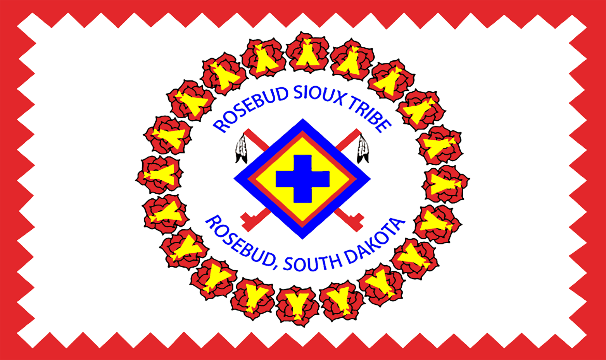

        <td> 
            
        </td>
        <td>
            
        </td>

---

About me:

Welcome to my to profile.  My name is William Blacksmith Sr. and I am an IT Specialist working for the Treaty Office located on the Rosebud Sioux Tribe reservation.  

---

Background:

Before working with the treaty office.  I spend 12 years working with the Rosebud Sioux Tribe  IT department.  I received my associates degree in Computer Technology at Sinte Glaska University.  In my 12 years working with our tribe, I worked as an IT tech on numeros projects that would help our tribe become more knowledgeable with technology as we move forward into the future of technologly.

---
